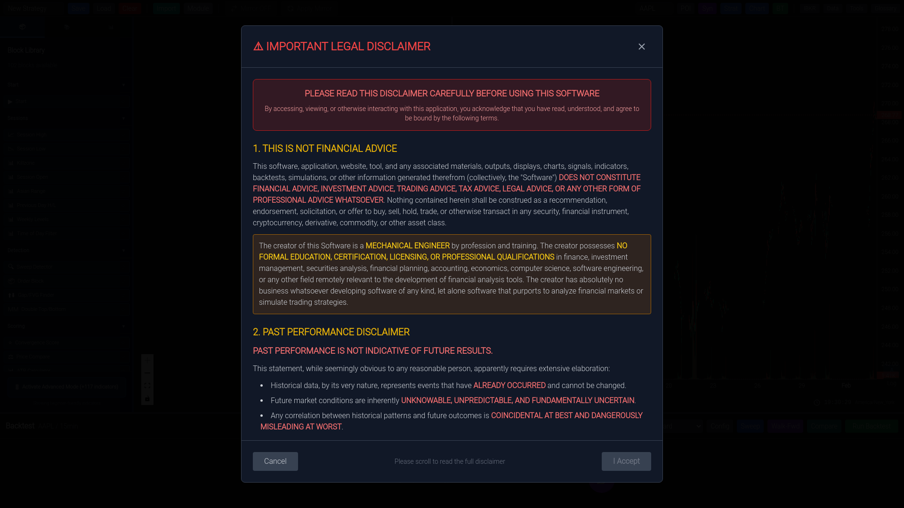
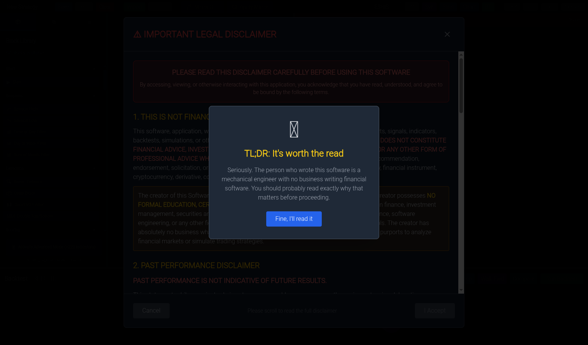
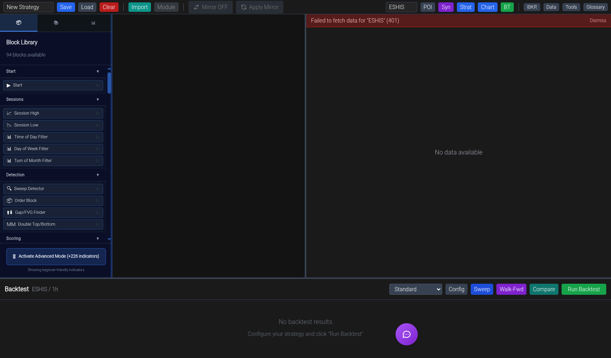
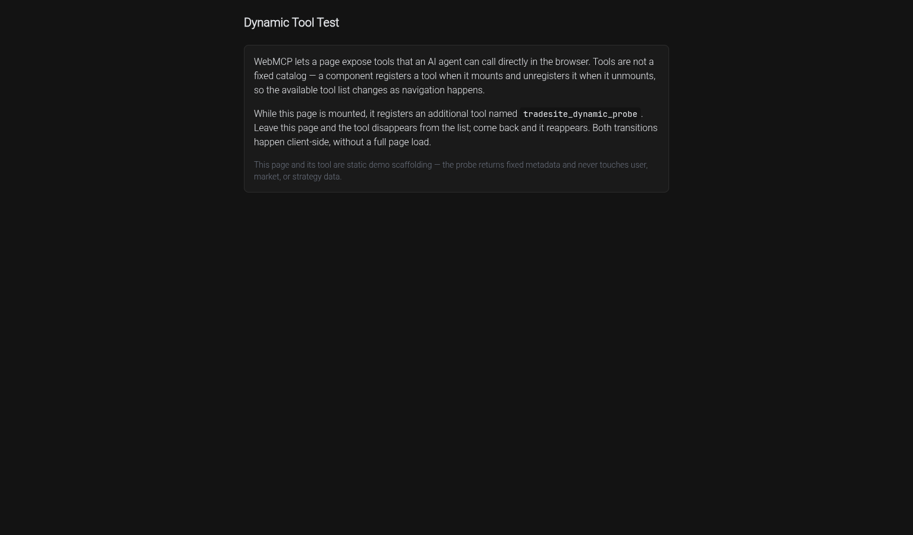

# Build in public, retroactively: seven months of TradeSite, reconstructed from the commit history

I never kept a devlog. It turns out I didn't need to — 6,230 commits across four repos kept one for me. This is the family photo album, reverse-engineered from `git log`: what got built when, what replaced what, and the death certificates for everything that didn't make it. Every date below comes from a commit.

**The cast:** me (a mechanical design engineer who opened VS Code for the first time on December 28, 2025) and a rotating team of Claude models — later, an entire organization of them.

## Chapter 0: PineScript (Thanksgiving 2025)

This all started with me trying to get ChatGPT, Gemini, and Claude.ai to help me write PineScript for TradingView after Thanksgiving 2025. No repo, no editor — just chat windows and copy-paste. The oldest artifacts on my GitHub are the fossils of that era: a repo literally named `Junk` (Dec 19), and `pinescriptv6-private` (Dec 29) — created one day after I installed VS Code because the copy-paste loop had become the bottleneck.

The lesson that started everything: the chat window was never the product. The *loop* was — describe, generate, test, correct. Everything since has been about making that loop faster, safer, and more honest.

## The four TradeSites: a family tree

| Repo | Born | Died | Commits | Cause of death |
|---|---|---|---|---|
| `TradeSite` | Dec 29 | Jan 15 (last commit; superseded Jan 17) | 89 | Architecture couldn't carry the ambitions. Superseded. |
| `tradesite-simplified` | Jan 17 | Jan 17 | **1** | Stillborn. One commit: "Clean TradeSite architecture with Massive API + DuckDB." The clean restart that immediately proved too clean. |
| `tradesite-reborn` | Jan 17 | Jan 20 | 5 | Second restart the same day. Lasted three days — long enough to prove the aggregation/scheduler design, not much else. |
| `TradeSite-unified` | Jan 20 | alive | 6,135 | — |

January 17–20 was the crisis window: three repos in four days. I'd built enough in three weeks to know the first architecture was wrong, and not enough to know what right looked like. `simplified` and `reborn` were both answers to "start over, keep what works" — the third attempt (`unified`) is the one that held, because it started by *importing* the working pieces instead of promising to rewrite them.

## Cadence

| Month | Commits | What it felt like |
|---|---|---|
| Dec 2025 | 31 | Chat-window survivor learns what a commit is |
| Jan | 76 | Three repo restarts; the crisis window |
| Feb | 165 | Feature explosion — auth, community, WebMCP, multi-position backtests |
| Mar | 211 | The great migrations (DuckDB→PostgreSQL, REST→socket) |
| Apr | 654 | The audit era begins; everything gets tested |
| May | 2,059 | The agent org comes online — commit rate ×3 |
| Jun | 2,311 | Peak swarm |
| Jul (12 days) | 723 | Agent-native front door ships |

The inflection is unmistakable: the month the multi-agent organization matured (May), throughput tripled — and stayed there. February-me wrote features. June-me ran an institution that wrote features.

## Track 1: The data layer — three generations

| Date | Event | Fate |
|---|---|---|
| Dec 29–31 | yfinance + Polygon.io flat files | superseded |
| Jan 15 | "Migration: Polygon.io → Massive API" | superseded as primary |
| Jan 17 | DuckDB becomes the store (per `simplified`'s one commit) | superseded |
| Feb 23 | encrypted DuckDB double-attach errors "across all endpoints" — the first sign the embedded DB and a concurrent web app disagree | terminal diagnosis |
| **Mar 15** | **"replace DuckDB with PostgreSQL/TimescaleDB data layer"** | alive |
| Mar 22 | "delete 18 deprecated DuckDB-era scripts" — the funeral | — |
| Mar 24 | automated PostgreSQL backups + WAL archival — landed within 48 hours of losing a session's work (see the failure ledger). Paranoia, learned. | alive |

## Track 2: The engine

| Date | Event |
|---|---|
| Jan 2 | first "comprehensive backtest system" (old repo) |
| Jan 25 | VectorBT backtesting + IBKR integration + smart-money analysis land in unified |
| Feb 13 | multi-timeframe backtester; multi-position backtests |
| Feb 24 | live execution exit-strategy support |
| Mar 24 | IBKR socket client (ib_async) goes in as drop-in for the REST client, dual-mode with parallel validation — then "Phase 4 — remove REST client, socket-only" the same day. Born and promoted to only-child within hours. |
| Apr 8 | solver extraction: signal generation and trade resolution become standalone packages (`tradesite-solver`, with the shared eval package following the next day) |
| Apr 21+ | the parity project: a reference-predicate registry as an independent oracle against the engine (agreement metrics tracked commit-by-commit: 18.7% → 34.1% → …) |
| May 17 | live-risk gates hardened after an "oppositional review" |
| Jun 17 | portfolio backtesting page |

## Track 3: The frontend — and why it's called SuperComboNew

The confession first. `SuperCombo` was born in the old repo on January 6 ("Phase 5: Super-Combo Block Library Implementation") as the strategy-builder page. On **February 9 at 07:41**, a commit titled "Major platform expansion" birthed `SuperComboNew.tsx`, `ControlBarNew.tsx`, and `StrategySectionNew.tsx` alongside the original. Sixteen hours later, at **23:23**, a second commit — literally titled "Overnight platform overhaul" — deleted `SuperCombo.tsx`. The suffix was accurate for sixteen hours. The migration shims were swept out on March 22, and at that point "New" described nothing — there was no Old — but by then the name was load-bearing in tests, routes, and muscle memory. It has now outlived its predecessor by five months. Every codebase has one of these. Mine is the flagship page.

State management tells its own generational story: props → `SuperComboContext` (Mar 15) → Zustand store (Mar 24). Two state architectures superseded in nine days, both during migration season.

Page births, by month (every page still alive today):

| Month | Pages born |
|---|---|
| Jan | Chart, DataAdmin, IBKR Account/Login, Tools, Futures |
| Feb | Glossary, Login/Register, **SuperComboNew**, MarketScanner, News, StrategyDashboard, UserManagement, Discovery, Account, Community (×2), Forum (×3), Leaderboard, Monitoring, PublicProfile |
| Mar | Pricing, Billing Success/Cancelled, Terms, TrainingDashboard, Welcome, WorkerSetup, ForgotPassword, LessonPlayer |
| Apr | Billing, BillingAddons, IndicatorProfiler |
| May | NotFound (day 135: the project admits URLs can be wrong), ProMode |
| Jun | PITScreener, PortfolioBacktest |
| Jul | DemoLanding, DynamicToolTest — the agent-facing pages |

February 27 alone birthed nine pages — community, forum, leaderboard, profiles — the day TradeSite decided it was a *platform*, not a tool.

## Track 4: The agent surface — the pivot

| Date | Event | Fate |
|---|---|---|
| Feb 13 | in-site assistant chat ships (a Claude chat embedded in the app), same day as the **WebMCP gateway** | chat: died Apr 16 |
| Apr 16 | **the pivot**: "advisory-only AI-agent surface across TradeSite" + "remove in-site Claude chat + all its plumbing" | alive |
| Apr 16–17 | tool catalog rewritten in "descriptive voice"; two waves of audit findings closed against the agent surface | alive |
| Jul 11 | Chrome origin-trial registration; anonymous front door with a dynamic-tool demo; the origin-trial unregister bug root-caused and fixed through the merge gate — all one day | alive |
| Jul 12 | console repro of the dynamic tool list posted publicly | alive |

The April 16 pivot is the single clearest strategic decision in the whole history: kill the embedded chatbot, bet the surface on *agents you don't ship* — anyone's agent, arriving over a protocol, greeted by tools instead of a UI. That was five months before I'd ever heard the phrase "agent-native." The WebMCP gateway predates the browser's own origin trial by five months.

## Track 5: "How the code knows itself" — six generations of code intelligence

This track got its own full audit (see the [executable institutional knowledge](2026-07-12-executable-institutional-knowledge.md) post for the discipline that grew out of it).

| Gen | Born | What it was | Died / superseded |
|---|---|---|---|
| 1 | Jan 25 | `.claude/index.json` + an `index-maintainer` agent: module catalog with exports, dependencies, and flow chains — **four weeks into my coding life** | deleted Apr 20; commit message says it plainly: "drop stale index.json, generate block catalog at runtime" |
| 1.5 | Feb 18 | handwritten `ARCHITECTURE.md` / `FEATURE-MAP.md` | folded into the two-file pattern |
| 2 | Feb 27 | **20 Haiku agents**, each assigned a partition of the codebase, reading every file and writing dependency JSON — with staged execution and random spot-checks against source | superseded Apr 8 |
| 3 | Apr 8 | deterministic parser (`ast` for Python, hand-rolled regex import-parser for TypeScript) replaces the agent fleet | evolved |
| 4 | Apr 14 | two-file pattern: handwritten narrative + generated map, per domain | alive |
| 5 | May 27–28 | `file-to-context.json`: per-file context overlay merging doc links, dep-map partition, and embedding nearest-neighbors (born from duplicate-code detection), injected by a hook the moment an agent touches a file | alive |
| 6 | Jul 6–10 | freshness monitors, self-healing cluster prune, auto-regeneration on integrator merge-drain | alive |

The arc in one sentence: *maintained* indexes rot at the speed of human attention (gen 1's update cadence visibly decays in the log before its deletion), so every following generation moved further toward *derived* — regenerate on demand, then regenerate on event.

Gen 2 deserves its epitaph: for six weeks, the codebase's self-knowledge was literally twenty small language models reading source files and writing down what they saw, like monks copying manuscripts. It worked. It was also slow and expensive enough that I went hunting for something faster — which is how I found out the rest of the world was converging on the same problem.

## Track 6: The agent org — from assistant to institution

| Date | Event |
|---|---|
| Jan 25 | first custom subagent definitions (`.claude/agents/`) |
| Feb 13 | in-app assistant switched to Haiku 4.5 with rate-limit handling — first model-tiering decision on record |
| **Mar 31** | **the intercom: 19 agents wired to a PostgreSQL-backed message bus** with push notifications |
| Apr 9 | shared eval package |
| **Apr 21** | **the audit harness, in one day**: invariants, structural detectors, semantic (embedding) detectors, drift tracking |
| Apr 22 | "rebuild audit-hardening work lost after session…" — the harness's first act: recovering its own lost construction |
| May 7–12 | the opus swarm: 394 commits in four rounds; the agent-sizing skill (which model for which job) written down May 12 |
| May 16 | `quarantine.py` — out-of-band edits (changes that didn't come through the pipeline) get caught and held |
| **May 17** | **the integrator**: one agent owns the main branch; all work arrives as gated branch submissions. The same day, the original intercom relay is archived — the message bus that got the org this far is retired by the org structure that replaced it |
| May 20–21 | honesty-guardrail toolkit; a guardrails spec gets bounced by the gate and resubmitted — the pipeline gating its own upgrades |

That last line is my favorite in the whole album. By late May, the system was strict enough that *improvements to the system* had to pass the system.

## The failure ledger

Things that died, and what each one taught:

- **`tradesite-simplified`** (Jan 17, one commit). Restarting clean feels like progress and usually isn't. Died in a day.
- **The in-site chatbot** (Feb 13 – Apr 16). A chat window bolted to an app is a demo, not a surface. Killed deliberately, plumbing and all, in favor of the agent-native bet.
- **DuckDB as the app database** (Jan 17 – Mar 15). Brilliant embedded analytics engine; wrong tool under a concurrent web app. The Feb 23 double-attach errors were the tell. Superseded by PostgreSQL/TimescaleDB; 18 scripts deleted at the funeral.
- **The IBKR REST client** (Jan 25 – Mar 24). Replaced by a socket client that ran in parallel validation mode before the REST path was removed the same day — the first time a migration used the "run both, compare, then cut" pattern that later became standard.
- **`tradesite-worker`** (Mar 15 – Apr 8). A distributed compute worker with CLI hardware detection and TOTP enrollment. Built in the SaaS-ambition sprint, removed three weeks later when the GPU work moved in-house. The most fully-realized dead end in the repo.
- **The original `SuperCombo.tsx`** (Jan 6 – Feb 9). Survived one repo migration, not the overnight overhaul. Its name lives on, wrongly, in its replacement.
- **`index.json` + the index-maintainer** (Jan 25 – Apr 20). Death by staleness. The commit that killed it stated the lesson: generate at runtime instead.
- **The Haiku mapping fleet** (Feb 27 – Apr 8). Twenty agents replaced by three hundred lines of `ast`. The rare case where the boring solution ate the clever one.
- **The March 22–24 data loss.** A session's work spanning the IBKR socket client, database migrations, and several features was lost before it ever reached main. The recovery came from two sources across six "recover" commits: eight files rebuilt by mining the session's own transcript ("Recovered from session transcript (3/22) — 8 files never committed"), and a larger set salvaged from a dangling commit. WAL archival and automated backups landed within 48 hours. We don't lose work anymore; the pipeline commits per merge now.
- **One repo-history rewrite** (Jun 29), with a punchline. First attempt was the gentle fix: a `.mailmap` merge to consolidate author identities, its commit message proudly noting "no history rewrite." The actual rewrite happened the same day — orphaning the old SHAs, silently wiping months off my GitHub contribution graph, and making the "no history rewrite" commit its own first casualty (it survives only in a backup bundle, disconnected from main). Filed under: read the docs on how contribution credit works *before* rewriting history, not after.

## The photo album

Only one screenshot was ever committed to git in seven months — but it's the right one: February 4, the legal disclaimer in its natural habitat, floating over the early strategy builder.

For the rest, we built a time machine: extract the frontend at a historical commit straight from the git object store, build it, serve it, photograph it. The February 8 build compiled on the first try — and when I tried to close the disclaimer without reading it, the resurrected app *guilt-tripped me* with a modal I'd completely forgotten writing:

It then refused to enable "I Accept" until the disclaimer had actually been scrolled. Compliance achieved, here is the original SuperCombo, photographed alive in its resurrection build — 94-block beginner library, empty canvas, and a red 401 banner because July's backend refuses to serve data to an unauthenticated February ghost:

And the same product today, from the other direction — the page that exists for visitors who aren't human:

## Epilogue

Reading it back, the album has three acts. **Act one (Dec–Feb):** a person learns to code by shipping — features pile up, restarts happen, names stop meaning things. **Act two (Mar–Apr):** the migrations — everything load-bearing gets replaced at least once, and testing arrives with teeth. **Act three (May–Jul):** the institution — agents get an org chart, a message bus, a gate, and an audit culture, and throughput triples while the failure ledger mostly stops growing.

The thing I'd tell December-me: the product was never the strategy platform. It was the system that builds it.

---

*Reconstructed 2026-07-12 from `git log` across four repos, with an adversarial review pass hunting for missing birth and death certificates. John Ward is a mechanical design engineer who fell into software in December 2025. Feedback welcome — file an issue on this repo.*
